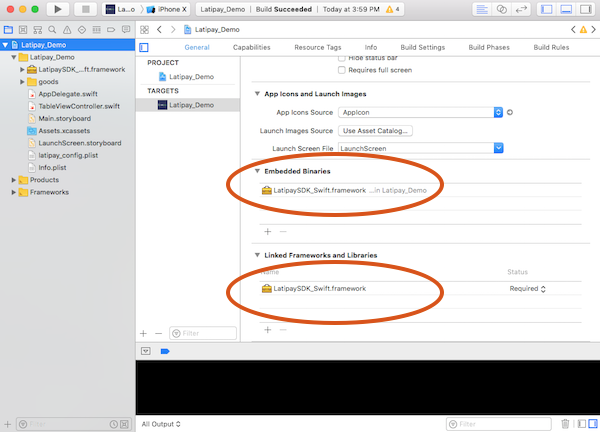
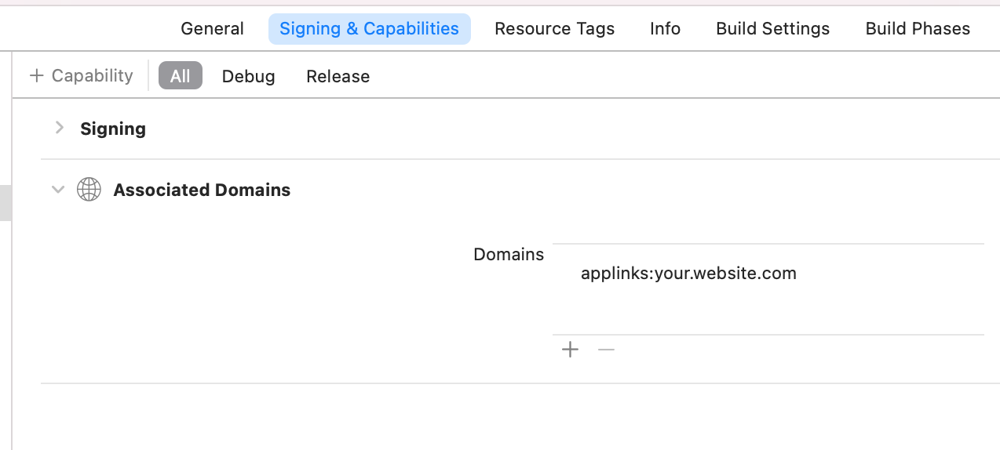

# LatipaySDK for iOS app

Using [Latipay](http://www.latipay.net) sdk to intergrate Alipay and Wechatpay payment solution. Alipay or Wechat app is required. Please run this demo on a device rather than simulator.

If you don't want to use this SDK, an alternative method of intergrating Latipay is using this [api doc](/api_doc.md) by yourself.


### What you must have before using this SDK.(If you don't know what they are, please contact us.)

Aliapy:

* user id
* wallet id
* api key
* alipay app installed

Wechat:

* user id
* wallet id
* api key
* enable [iOS deeplink](https://developer.apple.com/documentation/safariservices/supporting_associated_domains)
* wechat app id, set wechat universal link (deeplink) in advance [how to set?](https://developers.weixin.qq.com/doc/oplatform/Mobile_App/Access_Guide/iOS.html)
* wechat app installed

### 1. iOS project setup
* Download Latipay framework in this demo and drag it into your project

	
* add the following [Launch Services Key](https://developer.apple.com/library/content/documentation/General/Reference/InfoPlistKeyReference/Articles/LaunchServicesKeys.html) into info.plist;

	```xml
	<key>LSApplicationQueriesSchemes</key>
	<array>
	    <string>alipay</string>
	    <string>weixin</string>
	    <string>weixinULAPI</string>
	</array>
	```
* set your wechat app id as a scheme for wechatpay
* set a scheme for alipay, with the format of latipay$wallet_id, e.g. latipayW00000001
* Enable Associated Domains in project for wechatpay
	
* enable iOS deeplink: add deeplink configuration file(apple-app-site-association) in your server(e.g. example.com) and make sure it can be loaded as https://example.com/app/apple-app-site-association

	```
	{
	  "webcredentials": {
	    "apps": ["your_ios_app_teamId.your_ios_app_bundleId"]
	  },
	  "applinks": {
	    "apps": [],
	    "details": [
	      {
	        "appID": "your_ios_app_teamId.your_ios_app_bundleId",
	        "paths": ["/app/*"]
	      }
	    ]
	  }
	}
	```
* set universal link(e.g. https://example.com/app/) in your [wechat app](https://open.weixin.qq.com/)

### 2. Make a payment with Wechat and Alipay app in DEBUG
This way can help you to check your account and project setup correctness, but is not recommended in production for protecting your account information. In production, please make a transaction in your own back-end server first [Latipay Transaction Interface](/api_doc.md), and then call another method from this SDK.

* Setup Latipay account info

	```swift
	
	LatipaySDK.setup(
		withApiKey: "XXXXXX", 
		userId: "XXXXXX", 
		walletId: "XXXXXX", 
		wechatUniversalLink: "https://example.com/app/"
	)
	
	```

* launch wechat or alipay app to make payment

	```swift
	
	let para = [
	    "payment_method": "alipay", //wechat
	    "amount": "0.01",
	    "merchant_reference":"12312-12312312", //must be unique in your system
	    "product_name": "Fossil Women's Rose Goldtone Blane Watch", //optional
	    "callback_url": "https://youwebsite.com/pay_callback"
	    ]
	
	LatipaySDK.pay(para) { (result, error) in
	
	    //...save paymentId for check later
	
	}
	
	```	
	
	
### 3. Make a payment with Wechat and Alipay app in Production

* make a transaction in your back-end server. [Latipay Transaction Interface](/api_doc.md)

* launch wechat or alipay app to make payment with data (host_url, nonce) responded from the about api.

	```
	//both wechat and alipay
	
	LatipaySDK.pay(
		withHost: host_url, 
		nonce: nonce, 
		wechatUniversalLink: "https://example.com/app/"
	) { (result, error) in
          //the payment status is pending
    }
	```

### 4. Alipay app will send the result of payment to your app through schemes.

```swift
func application(_ app: UIApplication, open url: URL,
    options: [UIApplicationOpenURLOptionsKey : Any] = [:]) -> Bool {

    LatipaySDK.processPaymentResult(with: url) { (result) in
        //save orderId and status into server
        //..

        if (status == .paid) {

        }else if (status == .unpaid) {

        }else {
            //please query the result from your own server.
        }
    }

    return true
}
```

### 5. Wechat app will send the result of payment to your app through deeplink.
Please setup iOS deeplink in advance.

```swift
func application(_ application: UIApplication, continue userActivity: NSUserActivity, restorationHandler: @escaping ([UIUserActivityRestoring]?) -> Void) -> Bool {

    LatipaySDK.processPaymentResult(with: userActivity) { (result) in
        //save orderId and status into server
        //..

        if (status == .paid) {

        }else if (status == .unpaid) {

        }else {
            //please query the result from your own server.
        }
    }
}
```

### 6. When calling LatipaySDK.pay(), please set the `callback_url` for receiving the result of payment in your backend server. Latipay will notify your webserver the result through this api.

```
POST https://yourwebsite.com/pay_callback
Content-Type: application/x-www-form-urlencoded
```

Parameters:

```json
{
  "transaction_id": "43cb917ff8a6",
  "merchant_reference": "dsi39ej430sks03",
  "amount": "120.00",
  "currency": "NZD",
  "payment_method": "alipay",
  "pay_time": "2017-07-07 10:53:50",
  "status" : "paid",
  "signature": "14d5b06a2a5a2ec509a148277ed4cbeb3c43301b239f080a3467ff0aba4070e3",
}
```

[More info about this notify api](http://doc.latipay.net/v2/latipay-hosted-online.html#Payment-Result-Asynchronous-Notification)

### 7. If this SDK does not have a certain status of payment result, please query the result from your own server with merchant_reference in your order.


