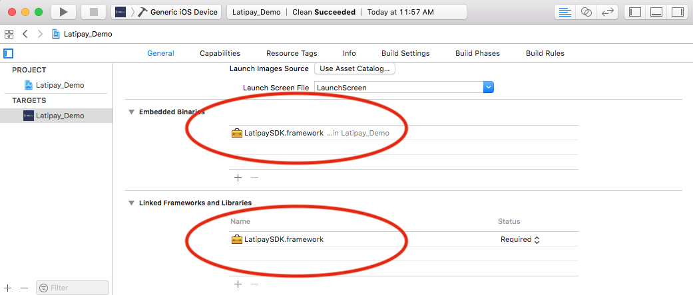

# LatipaySDK for iOS app

Using [Latipay](http://www.latipay.net) sdk to intergrate Alipay and Wechat pay payment solution. Alipay or Wechat app is required.


### What you must have before using this SDK.(If you don't know what they are, please contact us.)

* user id
* wallet id
* api key
* wechat app id
* alipay or wechat app installed

### 1. Download Latipay framework in this demo and drag it into your project




for iOS 9.0 and later, please add the following [Launch Services Key](https://developer.apple.com/library/content/documentation/General/Reference/InfoPlistKeyReference/Articles/LaunchServicesKeys.html) into info.plist;

```xml
<key>LSApplicationQueriesSchemes</key>
<array>
    <string>alipay</string>
    <string>weixin</string>
</array>
```

### 2. Setup Latipay info, [you can get apiKey here](https://merchant.latipay.net)

```swift

LatipaySDK.setup(withApiKey: "XXXXXX", userId: "XXXXXX", walletId: "XXXXXX")

```

### 3. How to use Alipay app to pay?

```swift

let para = [
    "payment_method": "alipay",
    "amount": "0.01",
    "merchant_reference":"12312-12312312", //must be unique in your system
    "product_name": "Fossil Women's Rose Goldtone Blane Watch", //optional
    "callback_url": "https://youwebsite.com/pay_callback"
    ]

LatipaySDK.pay(para) { (result, error) in

    //...save paymentId for check later

}

```

### 4. How to use Wechat app to pay?

```swift

let para = [
    "payment_method": "wechat",
    "amount": "0.01",
    "merchant_reference":"12312-12312312", //must be unique in your system
    "product_name": "Fossil Women's Rose Goldtone Blane Watch", //optional
    "callback_url": "https://youwebsite.com/pay_callback"
    ]

LatipaySDK.pay(para) { (result, error) in

    //the payment status is pending

}

```

### 5. Alipay or Wechat app will send the result of payment to your app through schemes.

* For Alipay app. Please set the scheme: latipay$wallet_id, for example: latipayW00000001
* For Wechat app. Please set `wechat app id` as the scheme.

```swift
func application(_ app: UIApplication, open url: URL,
    options: [UIApplicationOpenURLOptionsKey : Any] = [:]) -> Bool {

    LatipaySDK.processPaymentResult(with: url) { (result) in
        //save orderId and status into server
        //..

        if (status == .paid) {

        }else if (status == .unpaid) {

        }else {
            //please query the result from your own server.
        }
    }

    return true
}
```

### 6. When calling LatipaySDK.pay(), please set the `callback_url` for receiving the result of payment in your backend server. Latipay will notify your webserver the result through this api.

```
POST https://yourwebsite.com/pay_callback
Content-Type: application/x-www-form-urlencoded
```

Parameters:

```json
{
  "transaction_id": "43cb917ff8a6",
  "merchant_reference": "dsi39ej430sks03",
  "amount": "120.00",
  "currency": "NZD",
  "payment_method": "alipay",
  "pay_time": "2017-07-07 10:53:50",
  "status" : "paid",
  "signature": "14d5b06a2a5a2ec509a148277ed4cbeb3c43301b239f080a3467ff0aba4070e3",
}
```

[More info about this notify api](http://doc.latipay.net/v2/latipay-hosted-online.html#Payment-Result-Asynchronous-Notification)
